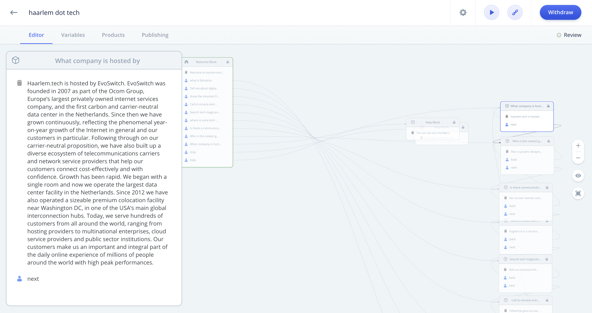

## Voice Design の基本
1.2 章では、VUIの特徴について改めて考察しました。1.3章では、VUI設計の基礎について学びます。

### VUIが活用できるシーン
これまで私たちが利用していたCUI(Character User Interface)やGUIと同じように、VUIにも利用するシーンがあります。VUIも決して銀の弾丸ではなく適したシチュエーションを選びます。それでは、VUIが活用できるシーンとはどのような場面でしょうか。
VOICE DESIGN GUIDEではVUIを活用するシーンの見つけかたとして３つのキーワードを提唱しています。

VUIにおけるキーコンセプトは、**FASTER・EASIER・MORE FUN(より早く・より簡単に・より楽しく)** の３つです。それぞれ見ていきましょう。

#### FASTER(より早く)
FASTER とは、ユーザーが目的をより早く達成したいというシーンを意味します。
電子レンジのタイマーをセットするシーンを想像しましょう。「電子レンジのある場所まで行き、３分間のタイマーをセットする」という所作は、 VUIを使えば「アレクサ、３分間のタイマーをセットして」という一言で片付きます。電子レンジと同様に、**モノのある場所に行って操作をする** という所作は生活の中に多くあります。「電気をつける」「テレビをつける」「明るさを調整する」「お風呂を入れる」などです。これらの所作をより早くするシーンということが **FASTER(より早く)** になります。

#### EASIER(より簡単に)
EASIER とは、これまでやってきた操作をより簡単に実行したいというシーンを意味します。音楽を聞きたくなったときに、スマートフォンやPCでアプリケーションを起動して曲を探して再生する。音量を上下させたい時に別のアプリケーションを起動して調整する。ジャンルや歌手の名前で聞きたいときは、検索バーで歌手の名前を打ち込み検索する。次の曲に行くのにもまた別のアプリケーションを起動して次の曲を再生する。これらの動作をVUIでは、「アレクサ、アーティストのXXXXを検索して」「アレクサ、ボリュームを下げて」「アレクサ、ロックを流して」とシンプルな発話で操作ができるようになります。これまでスマートフォンで操作していた複数のステップを、VUIを使うことによってシンプルにすることが **EASIER(より簡単に)** ということになります。

#### MORE FUN(より楽しく)
MORE FUN とは、ゲームに代表されるようにVUIを使って楽しむシーンを意味します。ユーザーにチャレンジングな状況を提供して成功と失敗の会話をデザインします。ユーザーがその会話を楽しめるように励まし讃え、時には慰めたりとより人間的に自然な会話でユーザーとインタラクションします。

このように、VUIはシチュエーションを選びます。作りたいと思ったものがこれらのシーンにマッチしているかどうかを作る前に十分検討しましょう。


### VUIデザインのプロセス
VOICE DESIGN GUIDEでは、VUIデザインのプロセスとして３つのステップを提唱しています。

#### Dialog sketch for happy path(ハッピーパススケッチ)
Dialog sketch for happy path(ハッピーパススケッチ)とは、ユーザーがスキルを使ってどのように幸せになるかをシンプルなダイアログで表現します。最初にAPIを設計しそれに合わせてVUIを当て込むことは良策ではありません。システムの挙動をそのままVUIに当て込むと、多くの場合は会話が複雑化しユーザーエクスペリエンスを損なう結果になります。

このプロセスでは、スキルが持つ最も基本となる会話を書き出し、スキルのゴールを明確化します。
ユーザーがスキルを使って何を達成できるのかを想像しながらスケッチしましょう。

VOICE DESIGN GUIDEでは、1〜4個のスクリプトで表現することが推奨されています。

最初は紙とペンで、会話を表現してみるのがよいでしょう。

このシートはGitHubにあるAlexa Cook Book上でテンプレートとして配布されており、誰でもダウンロードできます。
[https://github.com/alexa/alexa-cookbook/blob/master/guides/design.md](https://github.com/alexa/alexa-cookbook/blob/master/guides/design.md)

Alexaに限らず Actions On Google や LINE Clova に代表される音声AIアシスタントのバックグラウンドはディープラーニングです。Alexaが2014年にリリースされて以降、継続的な学習によって認識の精度は劇的に向上しました。それでも人間の会話には遠いというのが現状です。複雑なやりとりや長い発話が必要なスキルをAlexaは正確に認識できない場合があることを常に考慮しておきましょう。そしてこのハッピーパスに複雑な発話が出てきた場合は、シンプルな会話に置き換えてゴールできるかを考えることが重要です。
もしシンプルな会話でユーザーのゴールに到達できない場合は、設定したゴール自体を再検討するかスキルが使われるシチュエーションをもっと限定できないかを検討したほうがよいでしょう。

シチュエーションを限定したスキルの良い例として、USで公開されているStarbucks Reorderというスキルを紹介します。
このスキルはいつも利用している１０個のスターバックス店舗で普段頼むメニューを再オーダーできる、というスキルです。利用者の利用動向からVUIに適したシチュエーションを選択し、シンプルな発話で完結するよい例です。

[https://www.amazon.com/Starbucks-Coffee-Co-Reorder/dp/B01F9RRL46](https://www.amazon.com/Starbucks-Coffee-Co-Reorder/dp/B01F9RRL46)

Starbucks のメニューにはドリンクとフードが多くあります。ドリンクについてはサイズや細かなオーダー（ミルクをスキムミルクに変更、氷抜きなど）にも答えてくれます。店内で食べるかテイクアウトかという違いもあります。
VUIでこれらの操作を全て可能とするには、これらの会話のバリエーションを全て把握した上でデザインする必要があり、途方もない作業になることは想像に固くないでしょう。


#### Experience flow
ハッピーパススケッチができたら次は会話をフローに落とし込みます。会話がどのように進みどこに戻るのか。また、聞き取れなかった場合はどのように聞き返すのかをステートマシン図のようなフローで表現します。

フローを作成する際には、マインドマップツールやUMLの作図ツールなどを活用することで効率を上げることができます。もちろん紙とペンでも構いません。
この段階で、ユーザーとの発話パターンやスキルが利用するアレクサの機能を可能な限り洗い出しておくと後の作業が効率的に行えます。特に複数の外部サービスと連携したり、会話の数が非常に多いようなスキルを作る場合は、技術的なバックエンドや具体的なサービスの情報もこの時点で明確化しておくと実装する際の設計図としても利用できますので便利です。

逆に、作ろうとしているスキルの会話数が少なくシンプルな情報提供のみを行うようなスキルは、ノンコーディングでスキルの開発が可能な
「Storyline」を使って Experience flow を作りながらスキルを作ることができます。

Storyline
[https://getstoryline.com/](https://getstoryline.com/)



##### Experience flow に必要な要素

ここで、Experience flow に必要な要素を確認します。最低限フローに書き起こす項目は以下の５つです。

- 最短パス
- 代替パス
- シーンを前提とした会話のパス
- ヘルプパス
- アカウントリンクのフロー(スキルに必要な場合)


##### 最短パス

最短パス は、ユーザーが目的を達成する最もシンプルな会話のパターンです。多くのケースでは、ハッピーパスのフローになるでしょう。

##### 代替パス

代替パス は、ユーザーが目的を達成するハッピーパス以外のパスのことです。シンプルな発話で目的を達成できるパターンやユーザーからキーワードを受け取って目的を達成するパターンもあるかもしれません。スキルが到達するゴールへのパスを全て書き出します。
またスキルによっては、いくつかの要素が揃うまで、次の会話に進ませないパターンもあるでしょう。その場合の条件などもこの段階で定義をします。

##### シーンを前提とした会話のパス

VUIは、使われるシーンへの依存度が高いインタフェースです。デバイスとの間に距離があるケースや手が水に濡れているケース
、子供が話しかける場合やボタンと一緒に使う場合など、GUIの設計では出てこないシチュエーションが多くあります。定義した発話がどのようなシチュエーションで話されるかをエクスペリ
エンスフローに定義しておくと、VUIが明確になり、発話もシンプルに保ちやすくなります。

##### ヘルプパス

「画面が無いこと」を前提とするVUIでは、スキルの使いかたも音声で案内することになります。ヘルプパスは、ユーザーがヘルプを求めるタイミングとそれに適した
発話は何かを考えて定義します。スキルには「アレクサ、ヘルプ」という発話パターンがHelpIntentとして標準で組み込まれています。ずっと同じメッセージを
出すべきか、タイミングによって発話を変えるべきか、などユーザーの体験を損ねないようにこの段階で設計しておきましょう。

##### アカウントリンクのフロー(スキルに必要な場合)

スキルをパーソナライズさせるために、スキルはしばしば外部のIdentityProviderと連携をします。この連携を「アカウントリンク」とよびます。
スキルでアカウントリンクを利用する場合は、スキルをアレクサアプリで有効化する際にOAuth2による認証を行います。認証時には、スキルを利用するために必要な情報をユーザーから入力してもらう必要があるので、どのような情報をどのような形で入力してもらうのかをこの段階で設計しておきます。
[https://developer.amazon.com/ja/docs/account-linking/understand-account-linking.html](https://developer.amazon.com/ja/docs/account-linking/understand-account-linking.html)

これらの要素は、スキルの申請(後述)を行う際にも必要な要素となってきます。申請時にリジェクトされないように最低限前の５つは検討しておくように
しましょう。

最後に、Experience flow のプラクティスとして、
「目覚ましのタイマーをセットする」というシンプルな会話を考えてみましょう。

```
--ハッピーパス--

ユーザー： 明日 ７時に起こして
アレクサ： 午前、午後どっち？

ユーザー： 午前
アレクサ： 午前７時ね。OK。
```

目覚ましタイマーは必ず起床時刻をユーザーに発話してもらい確実に聞き取る必要があります。聞き取れなかった時の会話も考えてみましょう。

```
-- 聞き取れないときの会話 --

ユーザー： 明日 ７時に起こして
アレクサ： ごめん。聞き取れなかった。もう一回言って。

ユーザー： 明日７時にタイマーしといて
アレクサ： 午前、午後どっち？

ユーザー： 午後
アレクサ： 午後７時ね。OK。
```

ハッピーパスと聞き取れないときの会話を Experience flow に落とし込むと以下のようになります。


ちょっと待ってください。私たちが目覚ましをかけるとき **「午前または午後」** なんて毎回聞かれるでしょうか。使っているうちにめんどくさくなって
しまいます。より私たちが普段使っている会話へ近ずくために、もっと簡単な会話でタイマーセットできないでしょうか。
ここでは思い切ってシチュエーションを限定してしまうという方法が使えます。午前と午後でスキルをわけてしまうのです。


より短い会話のハッピーパスを作ることができました。

### Interaction model(インタラクションモデル)
Interaction model は、Experience flow を **インテント、発話サンプル、スロット**　に
落とし込む工程です。先ほど定義したフローに基づいて、インテント、発話サンプル、スロットと呼ばれるVUIの具体的な要素を
設計していきます。ここで定義した内容を Amazon Developer Console で スキルとして実装します。　

次の章では、これらの具体的な会話にフォーカスをして、よりよいVUIとは何かを考察していきます。
