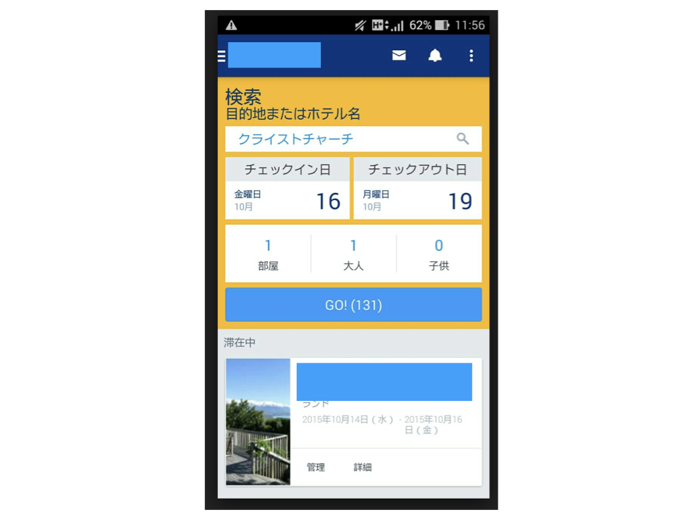
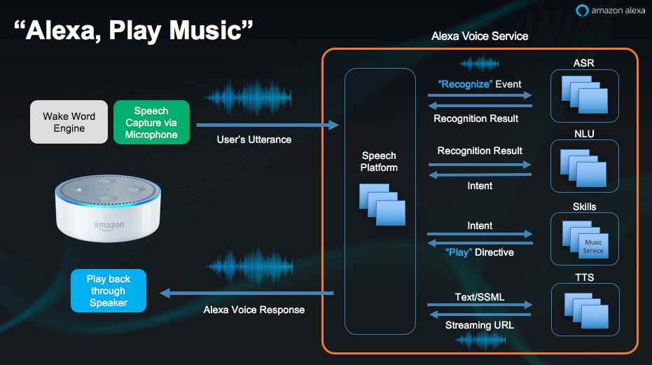
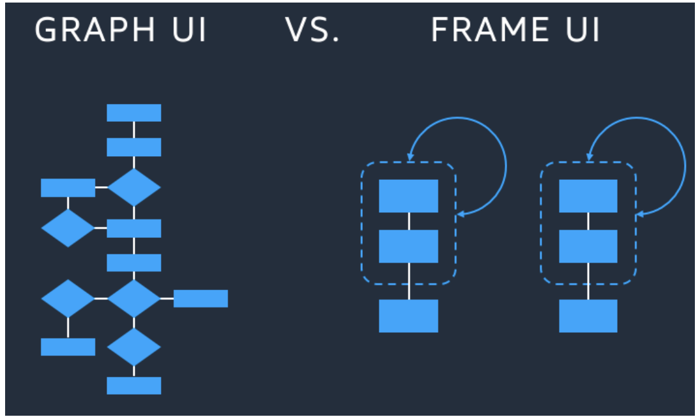

## より豊かな会話を目指して
この章では、ユーザーのUXを向上させるために必要な会話設計のテクニックを具体的に見ていきます。まずはVUIの設計要素について
改めて各要素を考察します。そして次にVUIの会話パターンについて、いくつか意識するポイントを押さえます。
最後に、具体的なシーンを想定して、VUIにおけるよい会話とは何かを見ていきます。

### インテント・発話サンプル・スロット
スキルの会話部分は Amazon Developer Console で インテント・発話サンプル・スロット を実装することによって組み上げます。
ここでは VUIの３大構成要素 インテント・発話サンプル・スロット について アレクサとの関係性を明らかにします。それぞれの要素が
どのような意味を持ち、設計する際何に気を配ればよいのかを考察します。

#### インテント
もしあなたがデベロッパーなら、インテントはユーザーの発話に応じて呼び出される関数というイメージが強いでしょう。このインテントを
VUIという観点から見た場合どのような意味があるのでしょうか。

インテントはVUIの視点から見るとユーザーの意図を定義するものです。ユーザーの意図を適切に汲み取るように、スキルの中の会話を設計する必要があるということを意味します。

ここで重要なのは粒度です。一つのインテントの中にユーザーの意図を沢山含めてしまうと会話がいつまでも終わらず、UXを損ねることになります。
WebサービスとしてGUIがすでに存在しており、機能をそのままVUIに落とし込むアプローチは概して複雑な会話になる傾向があります。

例をあげましょう。これは、よくあるオンラインのホテルの予約フォームです。



このフォームの中には、多くの入力項目があり、ユーザーから入力させる必要があります。
予約に必要な要素を会話から順番に取得しようとした場合、会話は長くなります。

```
ユーザー： アレクサ、ホテルの予約 を開いて
アレクサ： ホテルの予約 へようこそ。どちらまで行かれますか？

ユーザー： 秋田
アレクサ： 秋田県秋田市でよろしいですね。何名様ですか？

ユーザー： ４人
アレクサ： ４名さまですね。承知しました。お子様はいらっしゃいますか？

ユーザー： 子供がふたり
アレクサ： 子供が２名様ですね。お部屋は禁煙、喫煙どちらがご希望ですか？

ユーザー： 禁煙でお願いします。
アレクサ： 禁煙でおとりします。ご予算はいくらですか？

ユーザー： 一泊1人１万円まで
アレクサ： 承知しました。お一人様１００００円までですね。朝食はついているほうがよいでしょうか？

ユーザー： そうだね。よろしく
アレクサ： チェックインは何日でしょうか

ユーザー： １０月１日
アレクサ： チェックアウトは何日でしょうか？

ユーザー： １０月５日
アレクサ： では、いただいた条件でホテルは〇〇件あります。どちらのホテルを予約しますか？

ユーザー： ５つめ
アレクサ： 承知しました。〇〇ホテルを予約します。
```


それでは、条件を１つの会話でユーザーに発話させるパターンはどうでしょうか。会話は以下のようになるでしょう。

```
ユーザー： アレクサ、ホテルの予約 を開いて
アレクサ： ホテルの予約 へようこそ。どちらまで行かれますか、場所と時間、目的地、ご利用人数、ご予算、お子様の人数、お部屋のタイプをお伝えください。

ユーザー： １０月１日に秋田へ行きます。人数は４人で禁煙タイプ。予算は1人１万円までで４人で利用します。子供は2人います。
アレクサ： では、いただいた条件でホテルは〇〇件あります。どちらのホテルを予約しますか？

ユーザー：５つめ
アレクサ： 承知しました。〇〇ホテルを予約します。
```

会話としてはかなりシンプルになったようです。しかし、１つの発話の中に多くの条件が含まれているためAlexaが会話を聞き取れない、というリスクがあります。また GUIのようにユーザーから発話してほしい条件が画面付きのデバイスでなければどこにも表示されません。ユーザーは会話しているうちにそれまで言った条件を忘れてしまいます。

このように、GUIの機能をVUIにそのまま落としこむことは難しく、このようなアプローチは逆にUXを損ないかねないという問題を含んでいます。

VUIを設計する場合どのようなアプローチが適切でしょうか。検討してみましょう。

まずは、「ホテルを予約する」という目的がVUIとしては大きすぎます。ユーザーのニーズを少し細分化してみることにしましょう。

- 「一番安いホテルに泊まりたい」
- 「綺麗なホテルに泊まりたい」
- 「ファミリーでもいけるところ」
- 「ご飯が美味しいところ」
- 「素泊まり」

他にも多くのニーズがあるでしょう。アレクサの特性上これらをインテントとして定義するほうが、会話としてはシンプルになりそうです。
一番安いホテルを予約するニーズに答える発話を設計してみましょう。

```
ユーザー： アレクサ、東京都内で一番安いホテルを探して
アレクサ： チェックインはいつですか？

ユーザー： １０月１日
アレクサ： チェックアウトはいつですか？

ユーザー： １０月５日
アレクサ： 都内で一番安いホテルは xxxxx で 一泊 10000 円です。朝食付き、喫煙、チェックアウトは１１時です。

ユーザー： じゃあそこを予約して
アレクサ： はい。わかりました。

ユーザー： ありがとう
```

この会話のポイントは２つあります。
まず１つは、発話の時点で条件を絞り込んでいる点。安いホテルに限定をしています。
もう１つは、それ以外の条件はスキルが勝手に選んで提示している点です。
仮に全ての条件が揃っていなくても、最低限の「安いホテル」というニーズを満たした結果を提示することはできています。
ユーザーの目的に合致していればそこで会話は終わります。
合致していなければその条件を変えて再び検索することになります。再び検索することになっても、すでに一部のニーズには
マッチしているので、何回も条件を確認するより早く目的を達成できるでしょう。


##### 技術的な側面から見るインテント

インテントは後述する発話サンプルと結びついています。ユーザーの発話はアレクサの自動音声認識 ASR(Automatic Speech Recognition)とNLU(Natural Language Understanding)
によって認識されます。認識された発話からディープラーニングによって膨大な会話データから生成されたモデルとサンプル発話で与えられる発話例を教師データとして与え、ユーザーのインテントを特定します。
一致するインテントが見つかれば、インテントが呼ばれます。



インテントに多数の意図が含まれていると、NLUのプロセスでインテントが特定できなくなります。逆にインテントが細かすぎると、それぞれのインテントで発話サンプルに同じような発話が並び、NLUが違うインテントと誤認識をして異なるインテントを呼ぶという現象が発生します。このような状況はユーザーのUXを損なう要因になります。できる限り避けるべきです。

**インテント設計のポイント**

- インテントの原則「一つのインテントに一つの意図」を心がける
- 一つのインテントはできる限りシンプルな意図を表現する
- インテントの粒度は発話サンプルに同じような発話が並ばない程度の粒度に気をつける
- ユーザーのニーズをインテントとして定義する

##### インテント設計の例

ホテルを予約する場合のインテントの設計例を考えてみます。

- **悪い例**

```
ホテルを予約したい ----> BookingIntent
Alexaの質問に対して「はい」と答える ---> YesIntent
Alexaの質問に対して「いいえ」と答える ---> NoIntent
```

- `よい例`

```
◯人で泊まりたい ----> HowManyBooksIntent
{場所} に泊まりたい。 ---> WhereIsStayIntent
チェックイン時間を指定したい ---> CheckInTimeIntent
```

##### YesIntent と NoIntent
まず下の例を見てください。

```
ユーザー： アレクサ、ホテル予約 を開いて
アレクサ： ホテル予約 へようこそ。ご予定は？

ユーザー： ボストン
アレクサ： わかりました。ボストンにはたくさんのホテルがあります。一番高いホテルでよろしいですか？

ユーザー： はい
アレクサ： 予約しました。支払いを先に済ませますか？

ユーザー： はい
アレクサ： 支払っておきました。スケジュールに予定を登録しておきます。

ユーザー： ありがとう
```

ここで５行目と７行目の 「はい」 は意味が異なります。

５行目の意図： 「一番高いホテルを選ぶよ」
７行目の意図： 「今ホテル代支払っとくよ」

同じ語彙でもユーザーの意図は異なりますが、アレクサはそれだけで違いを見分けることはできません。
アレクサには、「はい・いいえ」というユーザーの発話を汲み取る **YesIntent** と **NoIntent** があります。
例のように、状況によって「はい・いいえ」の意味が変わってくるため、バックエンドで判別するコーディングが
必要になってきます。会話設計の中で「はい・いいえ」が多く出現するような場合は、対象となるインテントを
見直すか、具体的な発話でユーザーから回答を得られないかを検討しましょう。


#### 発話サンプル
発話サンプルとは、アレクサのNLUがインテントを特定する際の教師データ*1 として提供される会話パターンです。アレクサはユーザーの音声による発話をテキストとして文字起こししたあと、NLUで提供される学習モデルの結果と発話サンプルをマッチングし、インテントを特定します。VOICE DESIGN GUIDEでは、１つのインテントに対して、２０個以上の発話サンプルを定義することが推奨されています。
発話のサンプルを定義する際に意識するポイントは、インテントの章でも述べたように他のインテントと同じような発話にならないように考慮することです。

\*1 [https://en.wikipedia.org/wiki/Machine_learning](https://en.wikipedia.org/wiki/Machine_learning)

例を示します。
電話番号をユーザーに発話してもらう **PhoneNumberIntent** と同じ桁のPINコードを発話してもらう **PinCodeIntent** が定義されています。

```
PhoneNumberIntent
-------------------------
電話番号は　0120111111 です
番号は　0120111111 です
0120111111
0120111111 です
電話は 0120111111 です
:
```

```
PinCodeIntent
-------------------------
PINは　0120111111 です
PINコードは　0120111111 です
0120111111 が PINコードです
0120111111 です
PINコードは 0120111111
0120111111
:
```

上の例では、ユーザーが番号のみ発話した場合に、どちらのインテントが呼ばれるのかがわかりません。このような場合は必ず同じインテントに入るようにインテントをまとめます。

```
PhoneNumberOrPinCodeIntent
----------------------------
PINは　0120111111 です
PINコードは　0120111111 です
0120111111 が PINコードです
0120111111 です
PINコードは 0120111111
電話番号は　0120111111 です
番号は　0120111111 です
電話は 0120111111 です
:
```

これでユーザーが番号で発話すると  **PhoneNumberOrPinCodeIntent** が呼ばれるようになりました。あとはバックエンドでセッションの状態を管理して、PINコードか電話番号かを判別すればよいでしょう。


##### 技術的視点から見る発話サンプル
発話サンプルは、技術的な視点から見るとアレクサの NLU に与えられる教師データです。教師データとは、
ディープラーニングで用いられる学習モデルが出力する結果に影響を与えるデータのことです。アレクサは
ユーザーの発話を認識し、この教師データに基づいた結果を返却することによって発話サンプルとインテントとの
マッチングを行なっています。そのため異なるインテントで同じような発話をしていると、NLUからインテントを
特定しづらくなります。最終的にはインテントを特定できなくなります。


#### スロット
スロットとは、ユーザーの発話の中から抽出したいキーワードのことです。先ほどのホテル予約の例では、チェックインの日にち、
目的地、予算額などがスロットの候補になります。VUIの観点から見ると、スロットは発話の中でユーザーの意図を最も強く表現している箇所と
いうことができます。そのため、スロットは、開発者の定義した通りの箇所に正しく入ってもらうことを保証しなければいけません。
スキルは ダイアログモデル という方法で、このスロットの値をユーザーから確実に発話させることができます。しかし、だからといって
発話の中に多数のスロットを定義して、一気に情報を取得しようと考えるのは早計です。

居酒屋で飲み物をオーダーする発話サンプルとスロットの例です。

```
{Drink} を {Number} {Howto} でください ==> 例) 焼酎を２つ水割りでください
{Number} の {Drink} {Howto} ください　==> 例) ２つの焼酎を水割りでください
{Drink} {Howto} を {Number} ください ==> 例) 焼酎水割りを２つください
：
```
この場合ダイアログモデルを使って、確実に値を取得する会話の例を示します。

```
ユーザー： アレクサ、居酒屋ドリンクオーダー を開いて
アレクサ： 居酒屋オーダー へようこそ。このスキルではドリンクを注文できます。

ユーザー： 焼酎水割りを２つください
アレクサ： 焼酎でよろしいですか？

ユーザー： はい
アレクサ： 飲みかたは水割りでよろしいですか

ユーザー： はい
アレクサ： 数は２つでよろしいですか？

ユーザー： はい
アレクサ： オーダーを承りました。
```

しかし、この会話は実際に実装してみるともっと長くなります。スロットが多いため、一度に全て聞き取れることが
希なのです。

```
ユーザー： アレクサ、居酒屋ドリンクオーダー を開いて
アレクサ： 居酒屋オーダー へようこそ。このスキルではドリンクを注文できます。

ユーザー： 焼酎水割りを２つください
アレクサ： ドリンクを注文してください。

ユーザー： 焼酎
アレクサ： 焼酎でよろしいですか？

ユーザー： はい
アレクサ： 飲みかたを教えてください

ユーザー： 水割り
アレクサ： 飲みかたは水割りでよろしいですか

ユーザー： はい
アレクサ： 数は２つでよろしいですか？

ユーザー： はい
アレクサ： オーダーを承りました。
```

当然ながら、会話が長引けば長引くほどユーザーはスキルから遠ざかっていきます。酔っていることが想定されるので
なおさらです。継続的にアレクサは学習していくので認識制度は今現在も向上していますが、まだまだ十分とは言えません。
このような現状を踏まえて、１つの発話サンプルに定義するスロットは３つまでにとどめておきましょう。


### VUIデザインのためのフレーム
特にスロットを用いる発話を検討する場合、VUIデザインのためのフレームに関する知識があると便利です。ここでは、代表的な２つの
UIフレームを提示し、どちらがVUIに適しているのかを比較検討します。

#### GRAPH-UI と FRAME-UI
代表的なUIフレームは、GRAPH-UI と FRAME-UI です。


GRAPH-UI は、フローチャートやデシジョンツリーに代表される上から下へのフレームです。一つ一つ条件を
確認しながらゴールまで導くUIフレームです。会話が長くなればなるほど、「さっき何言ったっけ？」とユーザーの記憶に
頼ることになります。VUIにおいてGRAPH-UIは会話を複雑にさせる要因となります。

これに対してFRAME-UIは、複数の処理をグループにわけてグループごとに入場条件と退場条件があるフレームです。
VUIで考えた場合は、会話に必要なキーワードを収集するまで次の会話に進ませないということになります。

FRAME-UIはダイアログモデルの元になっているフレームです。VUIの視点で見るとインテントの退場条件は、
スロットの値を全て取得できた場合です。先ほどの居酒屋の会話を２つのインテントに分けて、ドリンクの種類と飲みかたが
決まらないと数を言えないようなVUIを設計した例を示します。

```
DrinkOrderIntent
--------------------------
{Drink}を{HowTo}
{Drink}{HowTo}
{Drink}
```

```
NumberOrderIntent
--------------------------
{Number}
{Number} ください
{Number} つ
```

あとは、バックエンド側で、DrinkOrderIntentが条件を満たさない限り、NumberOrderIntentを呼ぶことができないように
実装します。このように実装することで、インテントの担当する範囲が小さくなり、それぞれの会話をシンプルに保つことができる
ようになります。ぜひ、このテクニックを活用しましょう。

### 画面の有効な使いかた
日本では Echo Spotが2018年7月に発売されました。USではEcho Show、Echo Spotという２種類の画面付きアレクサが発売されています。
VUIデバイスにとって、画面はどのように利用すべきでしょうか。結論から言うと、画面は無いものとして設計することが大前提です。
画面への表示はあくまでも補助的な役割を逸脱してはなりません。例えばニュースを読み上げるスキルがあったとして、アレクサは
ニュースの概要のみを発話し、のこりの詳細が画面にテキストで表示されるとどうでしょうか。スマートフォンで見ればいいですし、
なにより、デバイスの場所まで行かなくてはなりません。画面をスキルで活用する場合は、ユーザーとデバイスとの距離やスキルが
使われるシチュエーションを考慮しましょう。

有効な方法として、それぞれの発話に対してどのような画面を出すかを定義した絵コンテを書いておくとよいでしょう。
