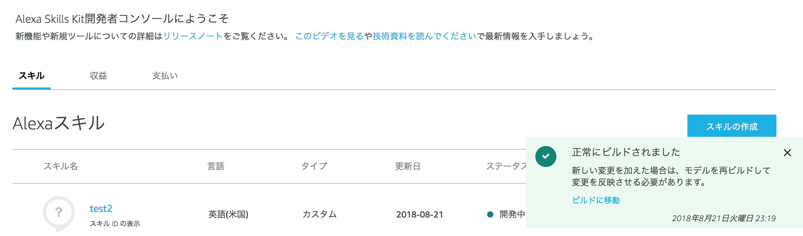

### ASK CLIで簡単セットアップ

スキルを開発する際にもっとも手軽な方法は、ASK CLIというCLIツールを利用することです。
ASK CLIについては第2章を確認してください。

それではASK CLIで作ったスキルの雛形を使ってバックエンドを作成・デプロイしていきましょう。
この章では、`lambda/custom`ディレクトリの中で作業を進めます。

#### スキルバックエンドをカスタマイズする

`ask new`で生成されたスキルのバックエンドソースコードは、`lambda/custom`配下に作成されています。

`package.json`を見ると、以下のようにスキル開発に必要な最低限のパッケージがすでにインストールされていることがわかります。

```json
{
  "name": "alexa-book",
  "version": "1.0.0",
  "description": "",
  "main": "index.js",
  "scripts": {
    "test": "echo \"Error: no test specified\" && exit 1"
  },
  "author": "",
  "license": "ISC",
  "dependencies": {
    "ask-sdk-core": "^2.0.0",
    "ask-sdk-model": "^1.0.0"
  }
}
```

実際の処理内容については、`index.js`を確認しましょう。

ask-sdkでの処理の実装方法はおおよそ以下のステップとなります。

##### 1: ハンドラーを作成する
ask-sdkの場合、`canHandle()`と`handle()`の２メソッドを持つオブジェクトを処理毎に作成します。
生成されたサンプルコードから一部をのぞいてみましょう。

```js
const HelloWorldIntentHandler = {
  canHandle (handlerInput) {
    return handlerInput.requestEnvelope.request.type === 'IntentRequest' &&
      handlerInput.requestEnvelope.request.intent.name === 'HelloWorldIntent'
  },
  handle (handlerInput) {
    const speechText = 'Hello World!'

    return handlerInput.responseBuilder
      .speak(speechText)
      .withSimpleCard('Hello World', speechText)
      .getResponse()
  }
};
```

この中では、`canHandle()` -> `handle()`の順番でメソッドが実行されます。

##### 2: canHandle()で対象のリクエストか判定
まずは`canHandle()`メソッドで、このオブジェクトの`handle()`メソッドを実行すべきかを判定します。
`handlerInput.requestEnvelope.request`の中には、作成された対話モデルに応じたインテントの種類や名前がセットされています。
このサンプルでは、「`IntentRequest`という種類」で「`HelloWorldIntent`というインテント」の場合にtrueが返されます。
つまり「`HelloWorldIntent`インテントが呼び出された時に実行されるハンドラー」と見ることができます。

###### 3: handle()に処理やレスポンスを実装
`canHandle()`がtrueを返した場合、`handle()`メソッドの内容がそのまま実行されます。
第一引数にはオブジェクトが渡され、よく使うプロパティとしては以下のようなものがあります。


###### requestEnvelope
リクエスト内容。セッション情報やインテント・スロットの値、デバイス・ユーザーの情報など。

###### responseBuilder
レスポンス内容を作成するためのメソッド。`.getResponse()`した値をreturnする。

###### serviceClientFactory
device address apiなどにアクセスするためのクライアントを作成するためのオブジェクト

「`handle()`の中で`requestEnvelope`の値を処理し、`responseBuilder`でAlexaに喋らせる内容をreturnする」と覚えると良いでしょう。
先ほどの例では、以下のような実装でした。

```js
  handle (handlerInput) {
    const speechText = 'Hello World!'

    return handlerInput.responseBuilder
      .speak(speechText)
      .withSimpleCard('Hello World', speechText)
      .getResponse()
  }
```
これは

- 「Hello World!」という内容をAlexaに喋らせる（`speak()`）
- 「Hello World」というタイトルで、「Hello World!」という内容のスキルカードを表示する(`withSimpleCard()`)
- `getResponse()`で`Response`オブジェクトを生成し、LambdaがJSONに変換して返す

という3つの処理を実行しています。

「今日の調子はどうですか？」のようにスキルからユーザーに質問や返答を促したい場合は、`reprompt()`というメソッドを追加します。

```js
  handle (handlerInput) {
    const speechText = 'こんにちは！調子はどうですか？'

    return handlerInput.responseBuilder
      .speak(speechText)
      .reprompt('今日の調子を教えてもらえると嬉しいです。どうでしょうか？')
      .withSimpleCard('Hello World', speechText)
      .getResponse()
  }
```

`reprompt()`メソッドを実行することで、スキルは発話後にユーザーの返答を待つようになります。
`reprompt()`メソッドの引数には、一定の時間（8秒程度）ユーザーからの返答がなかった場合に発話する内容を入れましょう。

また、ユーザーの返答を求める場合、`speak()`メソッドに入れる発話内容を疑問形で終わらせる必要があります。
これにはユーザーが今スキルから返答を求められているか否かをわかりやすくする効果があります。

この他にも様々なメソッドがありますが、ここでは基本的な部分のみをピックアップします。
より実践的な利用方法については、本章の後半で紹介いたします。

##### 4: ハンドラーオブジェクトを必要数分作成する

ここまでで１つハンドラーオブジェクトを作ることができました。
あとは1-3の手順を必要なハンドラーの数だけ繰り返すこととなります。

作成した対話モデルとは別に、以下のような特殊ハンドラーを作る必要があることにご注意ください。

###### LaunchRequest: 呼び出し名だけで起動した場合に実行するハンドラー
これは「アレクサ、XXXを開いて」のように呼び出し名だけで起動した場合に実行するハンドラーです。
ここではユーザーの返答を求めるケースが多くなりますので、`reprompt`メソッドを忘れないようにしましょう。

```js
const LaunchRequestHandler = {
  canHandle(handlerInput) {
    const request = handlerInput.requestEnvelope.request;
    return request.type === 'LaunchRequest';
  },
  handle(handlerInput) {
    const speechText = 'こんにちは！調子はどうですか？'

    return handlerInput.responseBuilder
      .speak(speechText)
      .reprompt('今日の調子を教えてもらえると嬉しいです。どうでしょうか？')
      .withSimpleCard('Hello World', speechText)
      .getResponse()
  },
};
```
###### SessionEndedRequest: セッションが終了した場合に実行するハンドラー
ユーザーからの返答が一定時間ない場合、スキルのセッションは自動で終了されます。
その際に`canHandle()`を以下のように定義したハンドラーが実行されます。

ここではユーザーが次回スキルを起動した場合に続きから再開できるようにする処理や、
不必要な情報の削除やデータのロールバックなどの処理を書くと良いでしょう。

また、Alexaが発話することはありませんので、`speak()`や`reprompt()`メソッドを設定する必要はありません。

```js
const SessionEndedRequestHandler = {
  canHandle(handlerInput) {
    const request = handlerInput.requestEnvelope.request;
    return request.type === 'SessionEndedRequest';
  },
  handle(handlerInput) {
    console.log(`Session ended with reason:
      ${handlerInput.requestEnvelope.request.reason}`);

    return handlerInput.responseBuilder.getResponse();
  },
};
```

##### 5: スキルビルダーを起動する
ハンドラーの準備が整えば、あとはLambdaが実行できるように仕上げるだけです。

まずは`ask-sdk`または`ask-sdk-core`から、スキルビルダーを起動させましょう。

```js
const Alexa = require('ask-sdk-core');
const skillBuilder = Alexa.SkillBuilders.custom();
```

Lambdaのハンドラーには、このスキルビルダーオブジェクトをreturnするようにします。

```js
exports.handler = skillBuilder
  .addRequestHandlers(
      LaunchRequestHandler,
      HelloWorldIntentHandler,
      SessionEndedRequestHandler
  )
  .addErrorHandlers(ErrorHandler)
  .lambda()
```

まず`addRequestHandlers()`で先ほど作成したハンドラーを１つずつ引数として登録します。
第一引数から順に`canHandle()`メソッドでの確認が行われる様子ですので、優先順位の高いハンドラーから登録することをおすすめします。

その後、エラーが発生した場合のフォールバック用のハンドラーを`addErrorHandlers()`で登録します。

フォールバック用のハンドラーは、以下のように書くと良いでしょう。

```js
const ErrorHandler = {
  canHandle() {
    return true;
  },
  handle(handlerInput, error) {
    console.log(`Error handled: ${error.message}`);

    return handlerInput.responseBuilder
      .speak('Sorry, an error occurred.')
      .reprompt('Sorry, an error occurred.')
      .getResponse();
  },
};
```


#### スキルをデプロイする
`ask deploy`コマンドを利用することで、ローカルで構築したスキルをデプロイすることができます。

```console
$ ask deploy
-------------------- Create Skill Project --------------------
Profile for the deployment: [default]
Skill Id: amzn1.ask.skill.xxx
Skill deployment finished.
Model deployment finished.
Lambda deployment finished.
Lambda function(s) created:
  [Lambda ARN] arn:aws:lambda:us-east-1:xxx:function:ask-custom-alexa-book-default
```

デプロイ時のメッセージに、スキルIDとLambdaのARNが表示されます。
CLIツールなどで操作する場合に引数として要求されますので、その場合はこの出力を見ると良いでしょう。

Alexaのスキルコンソールへアクセスすると、実際にデプロイされたスキルを見ることができます。


また、`ask deploy`は`-t`オプションを利用することで、Lambdaだけデプロイすることも可能です。

```console
$ ask deploy -t lambda
Lambda deployment finished.
Lambda function(s) updated:
  [Lambda ARN] arn:aws:lambda:us-east-1:xxx:function:ask-custom-alexa-book-default
```

