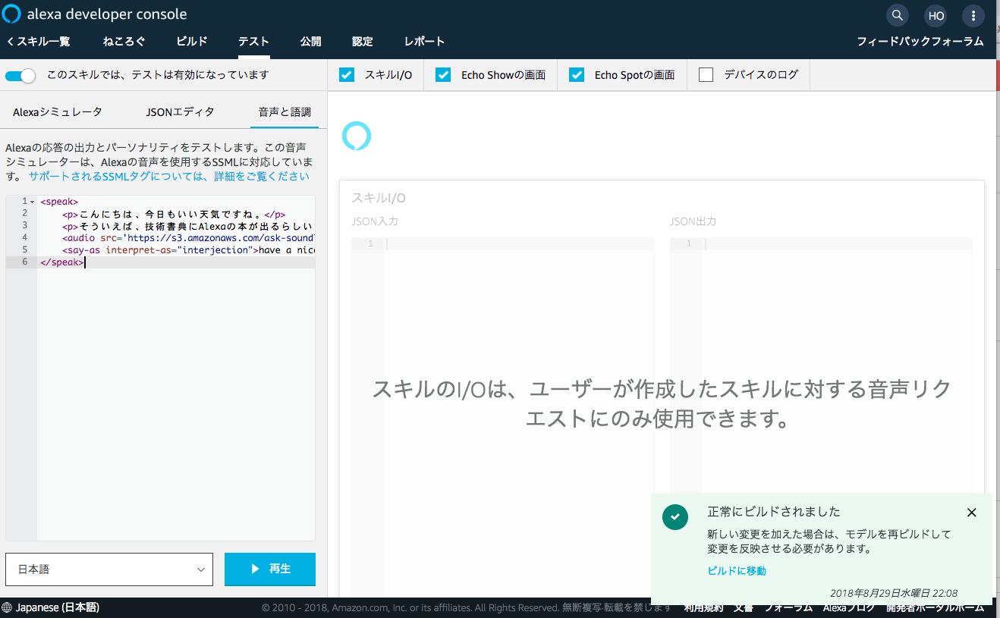

## Make emotional conversation by SSML
### SSMLで豊かな会話を

一般的に人間は、コミュニケーションの50％以上を身振り・手振りなどのボディーランゲージから得ていると言われています。
これは「メラビアンの法則」という、人の行動が他人に与える影響の割合についての法則で触れられています。  
Wikipedia: [https://ja.wikipedia.org/wiki/メラビアンの法則](https://ja.wikipedia.org/wiki/メラビアンの法則)

見た目や身振り・手振りなどの視覚情報が55％の割合を占め、口調や話の早さなどの聴覚情報が38％、話の内容などの言語情報が7％だとされています。

ここからわかることは、「音声インタフェースでは通常の半分以下しか情報を伝えられない可能性がある」ということです。
そしてさらに重要なことは、「口調や話す速度に気をつけなければ、1割もユーザーに伝わらない」ということです。
そのため、Alexaが聞き取りやすい返答をできるようにスキルからのレスポンスを作る必要があります。
Alexaのスキル開発では、この返答の口調や速度をカスタマイズするためにSSMLとよばれるマークアップ言語を使用します。

SSMLを利用することで、Alexaに喋らせる内容を以下のようにマークアップすることができます。

```html
<speak>
    <p>こんにちは、今日もいい天気ですね。</p>
    <p>そういえば、技術書典にAlexaの本が出るらしいですよ。</p>
    <audio
    src='https://s3.amazonaws.com
      /ask-soundlibrary/foley/amzn_sfx_clock_ticking_01.mp3'/>
    <say-as interpret-as="interjection">have a nice day</say-as>
</speak>
```

ここからは、SSMLを用いてより人間らしい会話をスキルに実装する方法を学びましょう。

#### Alexaで利用できるSSML

SSMLはW3Cによって仕様が決定されているマークアップ言語の１つです。
[https://www.w3.org/TR/speech-synthesis11/](https://www.w3.org/TR/speech-synthesis11/)
ただしW3Cでは定義されているものの、本章執筆時点（2018/08/30）でAlexaではサポートされていないタグも一部存在します。

本章執筆時点でAlexaスキルにて利用できるタグは、以下の通りです。

##### amazon:effect  
**用途：**  
Amazon固有の音声効果を利用します。  
**備考：**  
whispered(ささやき声)のみサポート

##### audio  
**用途：**  
src属性で指定したmp3ファイルを再生します。  

##### break  
**用途：**  
strengthまたはtime属性で指定した秒数休止します。

##### emphasis  
**用途：**  
タグで囲われた部分を強調します。

##### p  
**用途：**  
段落を表します。

##### phoneme  
**用途：**  
タグで囲われた部分の発音を定義します。  

##### prosody  
**用途：**  
タグで囲まれた音声の音量、高さ、速さを変更します。

##### s  
**用途：**  
センテンスを表します。末尾に句点を置いた時と同じ挙動です。

##### say-as  
**用途：**  
テキストの解釈を定義します。  

##### speak  
**用途：**  
SSMLドキュメントルート要素です。必ずこのタグの子要素に発話内容を記述してください。

##### sub  
**用途：**  
タグで囲われた部分を異なる単語やフレーズとして発音します。

##### w  
**用途：**  
単語の品詞を指定することで発音をカスタマイズします。

各タグの詳細については、Amazonが用意しているドキュメントをご確認下さい。

音声合成マークアップ言語（SSML）のリファレンス
[https://developer.amazon.com/ja/docs/custom-skills/speech-synthesis-markup-language-ssml-reference.html](https://developer.amazon.com/ja/docs/custom-skills/speech-synthesis-markup-language-ssml-reference.html)

#### AlexaでのSSMLのテスト方法
Alexaで使用するSSMLのテストは、スキルコンソールのテスト画面から実施することをお薦めします。
これは、`amazon:effect`などのAmazon独自の実装が含まれている可能性があるためです。


スキル詳細画面の[テスト]タブには、[音声と語調]というタブがあります。
このタブを開くと、SSMLの記述するフォームと再生ボタンが表示されます。


SSMLを使用する場合は、ここで違和感のない語調が作れているか確認してからスキルに組み込むと良いでしょう。

#### 実例から考えるSSMLユースケース
ここからは各タグをサンプルと共に少し深掘りしましょう。

##### 電話や郵便番号などの数値を扱う
数値を取り扱う場合、文脈によって読み方が大きく変化することもあります。
「1001234」という数値が郵便番号か金額、それとも何かのPINコードなのかは文言だけでは判別できません。

AlexaのSSMLでは、`say-as`タグを使うことで、数値の読み方を指定することができます。

```html
<speak>
    <p>書籍コードは<say-as interpret-as="characters">1001234</say-as>です。</p>
    <p>郵便番号は<say-as interpret-as="digits">1001234</say-as>です。</p>
    <p>金額は<say-as interpret-as="unit">1001234</say-as>円です。</p>
</speak>
```

また`interpret-as`に`date`属性を利用することで、数値を日付として扱うこともできます。

```html
<speak>
    <p>今日は<say-as interpret-as="date" format="d">22</say-as>です。</p>
    <p>今月は<say-as interpret-as="date" format="m">11</say-as>です。</p>
    <p>今年は<say-as interpret-as="date" format="y">2018</say-as>です。</p>
    <p>今日は<say-as interpret-as="date" format="ymd">20180922</say-as>です。</p>
    <p>今日は<say-as interpret-as="date">????0922</say-as>です。</p>
</speak>
```

##### 音声コンテンツにピー音を入れる
ラジオなどのエンターテイメントスキルを作る場合、コンテンツによっては「ピー」音で伏せたい箇所も出てきます。
そんなときは、`say-as`タグを使うことで指定した箇所だけ伏せることが可能です。

```html
<speak>
    <p>
        今度のイベントでは<say-as interpret-as="expletive">伊東</say-as>さんや
        <say-as interpret-as="expletive">栩平</say-as>さんが登壇予定です。
    </p>
    <p>正式な発表があるまで、もうしばらくお待ちください。</p>
</speak>
```

上記のサンプルでは、「いピーさんやはピーさんが登壇予定です」のように発話されます。
先頭１文字だけは聞こえますので、完全に伏せたい場合はタグ内の文字も適当な内容に変換しておく必要があります。

##### カウントダウン・カウントアップ
タイマーやゲームスキルを作成すると欲しくなるのが、「１・２・３」や「３・２・１・終了！」のようなカウントダウン・カウントアップです。
ただテキストを書くだけだとAlexaはそのまま１２３４５と流れるように数えてしまいます。
しかし`break`タグを利用することで、およそ1秒ずつカウントを進めることができます。

```html
<speak>
    <p>カウントを開始します。</p>
    <p>5 <break time="800ms" /></p>
    <p>4 <break time="800ms" /></p>
    <p>3 <break time="800ms" /></p>
    <p>2 <break time="800ms" /></p>
    <p>1 <break time="800ms" /></p>
    <p><say-as interpret-as="interjection">お疲れさまでした</say-as></p>
</speak>
```

実装時は、なるべく1カウント毎にsまたはpタグでマークアップすることをおすすめします。
数字のカウントは、1カウントが1文もしくは1センテンスだと考えることができます。
また1つの文章やセンテンスの中で多くの数字をカウントさせると、時折意図しない語調で発話されることがありますので、忘れずにマークアップしましょう。

##### サウンドライブラリを活用する
ゲームスキルやインタラクティブな動きをするスキルでは、効果音を利用したくなるケースがあります。
通常ではmp3ファイルを用意してアップロードする必要がありますが、「Alexa Skills Kitサウンドライブラリ」を利用することでより手軽に効果音を導入できます。

Alexa Skills Kitサウンドライブラリ
[https://developer.amazon.com/ja/docs/custom-skills/ask-soundlibrary.html](https://developer.amazon.com/ja/docs/custom-skills/ask-soundlibrary.html)

サウンドライブラリの中には、一定秒数待機する用の音源なども用意されています。
ですので、以下のサンプルのように30秒すると正解を発表するクイズゲームのアシスタントを作ることもできます。

```html
<speak>
  <audio
  src='https://s3.amazonaws.com
    /ask-soundlibrary/human/amzn_sfx_crowd_cheer_med_01.mp3'/>
  <p><say-as interpret-as="interjection">それでは</say-as><prosody volume="x-loud"
    pitch="high">問題</prosody></p>
  <p>AWSの正式名称は？</p>
  <p>30秒以内に、正解だと思うカードをとってください。</p>
  <audio
    src='https://s3.amazonaws.com
      /ask-soundlibrary/ui/gameshow/amzn_ui_sfx_gameshow_
    countdown_loop_32s_full_01.mp3'/>
  <break time="100ms" />
  <p>正解は、「アマゾンウェブサービス」でした。</p>
</speak>
```

サポートされているカテゴリは以下の通りです。

- Ambience（環境音）
- Animal Sounds（動物の声）
- Battle（戦闘音）
- Cartoon（アニメの音）
- Foley（効果音）
- Game Show（ゲームショーサウンド）
- Home（家庭の音）
- Human（人間の音）
- Impact（破裂音や衝突音）
- Magic（魔法の音）
- Musical（楽器などの音）
- Nature（自然の音）
- Office（オフィスの音）
- SciFi（SFの音）
- Transportation（乗り物の音）


##### Speechconを活用する
通常のマークアップだけでは、正しく発音することができてもそこに感情を込めることが困難です。
「やった」や「おめでとう」のように感情を込めた発話をさせたい場合に利用するのが、Speechconとよばれるものです。

例えばスキルを初めて起動した方を想定した発話をマークアップしてみましょう。
そのままタグに起こすと、以下のようになります。


```html
<speak>
    <p>初めまして</p>
    <p>このスキルは、スピーチコンをひたすら試すスキルです。</p>
    <p>お役に立てればうれしいです</p>
    <p>たくさん話しかけてくださいね</p>
    <p>またいつでもどうぞ</p>
    <p>have a nice day</p>
</speak>
```

このままでも発話自体は問題なく行われますが、やはり機械が話している印象がぬぐいきれません。
また最後の英文についても、意図した通りに発話されていないことにも気づくでしょう。

そこで上記のサンプルにSpeechconを適応してみましょう。

```html
<speak>
    <p><say-as interpret-as="interjection">初めまして</say-as></p>
    <p>このスキルは、スピーチコンをひたすら試すスキルです。</p>
    <p><say-as interpret-as="interjection">お役に立てればうれしいです</say-as></p>
    <p><say-as interpret-as="interjection">たくさん話しかけてくださいね</say-as></p>
    <p><say-as interpret-as="interjection">またいつでもどうぞ</say-as></p>
    <p><say-as interpret-as="interjection">have a nice day</say-as></p>
</speak>
```

実際に再生させると、発話の内容がより感情豊かになったことがわかります。
スキルをよりアシスタントらしく振る舞わせるためにも、Speechconは欠かせない存在です。
Speechconは事前定義されているもののみが利用可能ですので、スキル特有の発話についてはある程度割り切る必要があります。
しかしSpeechconを利用できるような内容に調整することは可能ですので、リファレンスを見ながらぜひ発話を組み立ててみてください。

日本語で利用できるSpeechconはAmazonのドキュメントから確認することができます。

Speechconリファレンス（感嘆詞）: 日本語
[https://developer.amazon.com/ja/docs/custom-skills/speechcon-reference-interjections-japanese.html](https://developer.amazon.com/ja/docs/custom-skills/speechcon-reference-interjections-japanese.html)


#### SSMLを利用する時の注意点
`withSimpleCard()`や`addRenderTempalteDirective()`の引数にSSMLが含まれた値を送らないようにしましょう。
SSMLを使用してくれるのは、`speak()`や`reprompt()`といった発話に利用する関数のみです。
スキルカード上などではSSMLタグがそのまま文字列として出力されてしまいますので、実装時には注意してください。

筆者はask-cliのsimulationコマンドをMochaで動かして、スキルカードの出力にSSMLが含まれていないかをチェックしています。

```js
const assert = require('power-assert')
const { execFile } = require('child_process')

describe('test by ask-cli', () => {
  it('should return valid response when send invocation name', (done) => {
    execFile('ask', [
      'simulate', '-s', 'amzn1.ask.skill.xxx',
      '-l', 'en-US', '-t', 'open greeter'
    ], (error, stdout, stderr) => {
      if (error) {
        assert.deepEqual(error, {})
      } else {
        const { result } = JSON.parse(stdout)
        const { invocationResponse } = result.skillExecutionInfo
        const { response } = invocationResponse.body
        assert.equal(response.card.content.indexOf('<p>'), -1)
        assert.equal(response.card.content.indexOf('undefined'), -1)
      }
      done()
    })
  })
})
```
