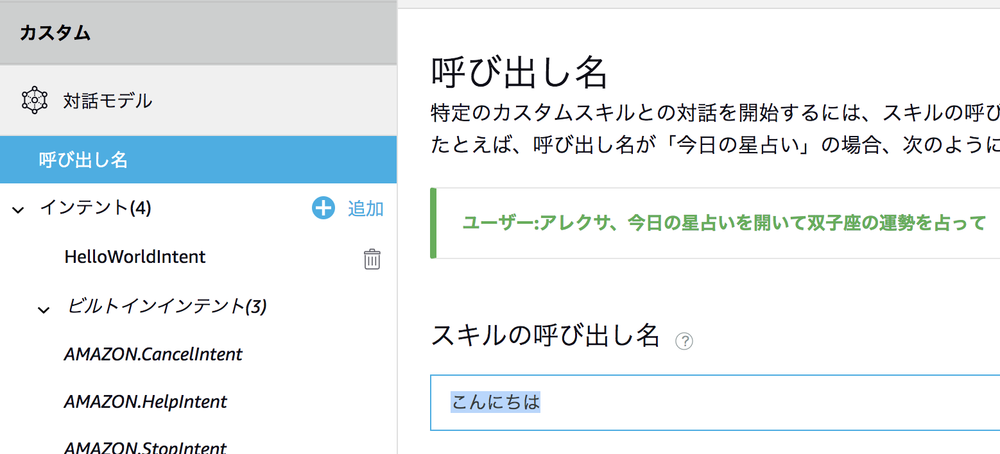

## スキルコンソールの内容を比較

ここまでの手順で、ローカルで変更した内容をスキルコンソールにデプロイして動作確認まで出来るようになりました。では、スキルコンソールで変更した内容をローカルに反映するにはどうしたら良いでしょうか？

まずは、ローカルとスキルコンソールでどの様な差分が発生しているのかを知る必要があります。そこで便利なコマンドが`ask diff`です。試してみましょう。

まずは、スキルコンソールからスキルの呼び出し名を`greeter`から`こんにちは`に変更してモデルを保存してみましょう



これでローカルの`models/ja-JP.json`とスキルコンソールの内容に差分が発生しました。それでは`ask diff`で差分を表示してみます。

```console
$ ask diff

Your skill.json differs from the latest version.

Your models/ja-JP.json differs from the latest version.

Your Lambda function
  arn:aws:lambda:us-east-1:xxx:function:ask-custom-alexa-book-default
  is up to date.

No in-skill product for the current skill.

===================================================================
--- local models/ja-JP.json
+++ remote models/ja-JP.json
@@ -1,41 +1,29 @@
 {
   "interactionModel": {
     "languageModel": {
-      "invocationName": "greeter",
+      "invocationName": "こんにちは",
```

この様にローカルとスキルコンソールの差分がDiffとして表示されます。

### オプション

指定できるオプションは次のとおりです。

#### --target / -t

`ask diff`では、スキルのモデルやLambdaなど複数のリソースを比較します。これらを別々に比較する場合に利用できるのが`--target`です。指定できる値は、`all`、`lambda`、`skill`、`model`、`isp`です。デフォルトは`all`です。

### ask cloneでスキルコンソールの内容をローカルに上書きする

では次にスキルコンソールで変更した内容をローカルに反映してみます。`ask diff`の結果を見ながら手動で変更することもできますが、`ask clone`を使えば簡単に解決できます。

`ask clone`はスキルの対話モデルやLambdaの内容をローカルに取得するコマンドです。既にスキルコンソールで作成済みのスキルをローカルで開発したい場合に利用できます。

`ask clone`で取得すると第一階層にはスキル名のフォルダが作成されます。もしも同じ名前のフォルダが存在する場合には上書きされます。

この仕組みを利用すれば、ローカルとスキルコンソールで発生した差分を解消するためにスキルコンソールの変更内容をローカルに反映することが可能です。

```console
$ ask clone

? List of all your skills. (Use arrow keys)
  ──────────────
  Skill Name  :  Skill Id
  ──────────────
> alexa-book: [amzn1.ask.skill.xxx]

-------------------- Clone Skill Project --------------------
[Warn]: Project with same name existed. Project will be overwritten.

Project directory for alexa-book created at
    ./alexa-book

Skill schema for alexa-book created at
    ./alexa-book/skill.json

Skill model for ja-JP created at
    ./alexa-book/models/ja-JP.json

Lambda cloned successfully for the following ARN(s):
    arn:aws:lambda:us-east-1:xxx:function:ask-custom-alexa-book-default

No in-skill product associated with current skill.
```

ローカルとスキルコンソールの両方で変更を行っている場合には残念ながら一部手動で変更を反映する必要があります。ローカルは`git commit`しておいて、`ask clone`でスキルコンソールから上書きを行い`git diff`を見ながら手動で反映していくのが効率的でしょう。

### オプション

指定できるオプションは次のとおりです。

#### --skill-id / -s

クローンしたいスキルのIDを指定します。未指定の場合には`.ask/config`内で指定してあるスキルIDが利用されます。

```console
$ ask clone -s amzn1.ask.skill.xxx
```

### 注意点

既存のスキルを`ask clone`で取得した場合には少しだけ工夫が必要です。
例えば下記の順番で既存スキルをクローンして公開審査に提出してみましょう。

```console
$ ask clone -s amzn1.ask.skill.xxx
...ここで少し時間を置く
$ ask api submit -s amzn1.ask.skill.xxx

Call submit error.
Error code: 403
{
  "message": "Skill is not ready for submission.",
  "violations": [
    {
      "message": "publishingInformation.locales.ja-JP - object has missing required
        properties (["largeIconUri", "smallIconUri"])"
    }
  ]
}
```

このエラーは公開審査に必要な`largeIconUri`と`smallIconUri`が設定されていないと言っています。しかし、このスキルにはアイコンが正しく設定しています。

`ask diff`で差分を表示してみると`largeIconUri`と`smallIconUri`のURIに指定されているパラメーターの`Expires=xxx&Signature=xxx`に差分が発生しています。これはスキルのアイコンがAWSのS3アップロードされていて、URIは期限付きとなっているのが原因です。

期限切れのアイコンのURIで公開申請を行うと画像が見つからずに先程のエラーが発生したと思われます。この様な場合には`ask clone`で最新の期限付きURIで上書きする必要があります。