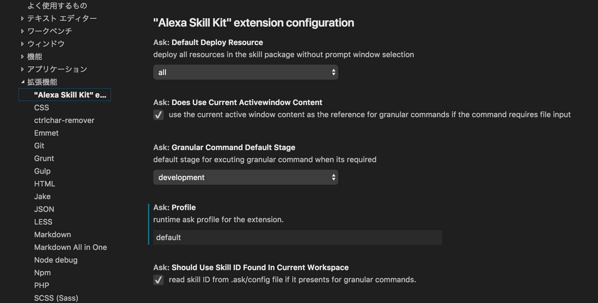
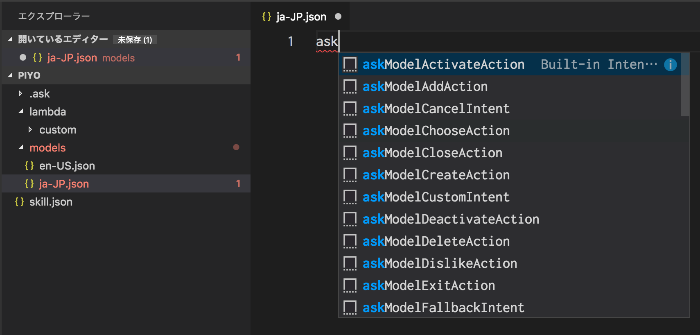
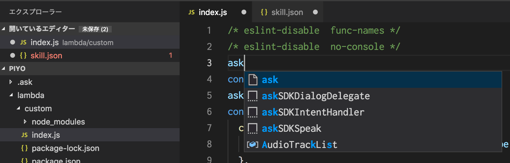

# Alexa Skills Kit Toolkit

Written by: Tomoyuki Tochihira

## はじめに

スキルの開発には、IDEやエディターなど自分の好みの開発ツールが利用できます。
この章ではMicrosoftが提供するVS Code（Visual Studio Code）とASK Toolkit（Alexa Skills Kit Toolkit）を組み合わせた開発ツールを紹介します。

## セットアップ

セットアップ非常に簡単です。まずはVS Codeをダウンロードします。

Visual Studio Code - Code Editing. Redefined
[https://code.visualstudio.com/](https://code.visualstudio.com/)

次に拡張機能として提供されているASK Toolkitをインストールして有効化します。

Alexa Skills Kit (ASK) Toolkit (Beta) - Visual Studio Marketplace
[https://marketplace.visualstudio.com/items?itemName=ask-toolkit.alexa-skills-kit-toolkit](https://marketplace.visualstudio.com/items?itemName=ask-toolkit.alexa-skills-kit-toolkit)

ASK Toolkitを利用するにはASK CLIのインストールも必要になります。ターミナルからASK CLIもインストールしてください。

```console
$ npm install -g ask-cli
```

これだけでVS CodeからASK Toolkitが使えるようになります。

```console
VS Code 1.27.1
ASK Toolkit 0.2.1
ASK CLI 1.4.1
```

## AKS Toolkitの設定

このままでも利用できますが、少し設定を追加するとより便利に使うことができます。

ASK Toolkitでコマンドを利用するにはAWSプロフィール情報が必要な場合もあります。このままだとコマンドを実行するたびにAWSプロフィール情報を選択する必要があります。
そこで、VS Codeの設定でプロフィール情報のデフォルトを設定してあげましょう。



## コマンド

VS CodeのコマンドパレットからASK Toolkitを呼び出してみます。コマンドパレットで`ask`と入力するとASK Toolkitの様々なコマンドが確認できます。
また、ASK Toolkitを利用する場合にはVS Codeでワークスペースを開いている状態にする必要があります。

### Initialize / Configure the ASK CLI

`ask init`が呼び出されます。ASK CLIのプロフィールの設定などを行えます。

### Clone a skill

`ask clone`を呼び出します。複数のスキルが存在する場合には一覧からクローンしたいスキルを選択します。

```console
$ ask clone --profile "default"

? List of all your skills. (Use arrow keys)
  ──────────────
  Skill Name  :  Skill Id
  ──────────────
> alexa-book: [amzn1.ask.skill.xxx]
  hello-world: [amzn1.ask.skill.xxx]
```

### Contact Alexa Team for any extension questions

Alexaのお問い合わせ、フォーラムをブラウザで開きます。選択できるのは次の3種類です。

- Contact Alexa Developer Support
  - [https://developer.amazon.com/ja/support/contact-us?subjectCategory=ALEXA](https://developer.amazon.com/ja/support/contact-us?subjectCategory=ALEXA)
- Go to the Amazon Developer Forums
  - [https://forums.developer.amazon.com/spaces/165/index.html](https://forums.developer.amazon.com/spaces/165/index.html)
- Submit a new feature request 
  - [https://alexa.uservoice.com/forums/906892-alexa-skills-developer-voice-and-vote](https://alexa.uservoice.com/forums/906892-alexa-skills-developer-voice-and-vote)

### Create a basic skill package

`ask new`を呼び出します。スキル開発の起点となる基本的なプロジェクトを作成します。

### Create a skill from a template

テンプレートから新規プロジェクトを作成します。選択できるプロジェクトは次の通りです。

- Buttons ColorChanger
  - [https://github.com/alexa/skill-sample-nodejs-buttons-colorchanger](https://github.com/alexa/skill-sample-nodejs-buttons-colorchanger)
- City Guide
  - [https://github.com/alexa/skill-sample-nodejs-city-guide](https://github.com/alexa/skill-sample-nodejs-city-guide)
- Decision Tree
  - [https://github.com/alexa/skill-sample-nodejs-decision-tree](https://github.com/alexa/skill-sample-nodejs-decision-tree)
- Fact
  - [https://github.com/alexa/skill-sample-nodejs-fact](https://github.com/alexa/skill-sample-nodejs-fact)
- Feed
  - [https://github.com/alexa/skill-sample-nodejs-feed](https://github.com/alexa/skill-sample-nodejs-feed)
- Foodie
  - [https://github.com/alexa/skill-sample-nodejs-the-foodie](https://github.com/alexa/skill-sample-nodejs-the-foodie)
- High Low Game
  - [https://github.com/alexa/skill-sample-nodejs-highlowgame](https://github.com/alexa/skill-sample-nodejs-highlowgame)
- How To
  - [https://github.com/alexa/skill-sample-nodejs-howto](https://github.com/alexa/skill-sample-nodejs-howto)
- Pet Match
  - [https://github.com/alexa/skill-sample-nodejs-petmatch](https://github.com/alexa/skill-sample-nodejs-petmatch)
- Quiz Game
  - [https://github.com/alexa/skill-sample-nodejs-quiz-game](https://github.com/alexa/skill-sample-nodejs-quiz-game)
- Team Lookup
  - [https://github.com/alexa/skill-sample-nodejs-team-lookup](https://github.com/alexa/skill-sample-nodejs-team-lookup)
- Trivia
  - [https://github.com/alexa/skill-sample-nodejs-trivia](https://github.com/alexa/skill-sample-nodejs-trivia)

### Delete a skill

`ask api delete-skill`を呼び出します。VS Codeで開いているスキルまたはスキルIDを指定する事でスキルコンソールから該当のスキルを削除します。Lambdaの関数は削除されません。

### Deploy the skill

`ask deploy`が呼び出されます。デプロイするターゲットを指定することも可能です。各ターゲットを直接呼び出せるコマンドがあります。

### Deploy the in-skill purchase (ISP)

`ask deploy --target "isp"`が呼び出されます。スキル内課金のファイルのみデプロイします。

### Deploy the interaction model(s)

`ask deploy --target "model"`が呼び出されます。スキルモデルのみデプロイします。

### Deploy the skill manifest

`ask deploy --target "skill"`が呼び出されます。スキルマニフェストのみデプロイします。

### Deploy the AWS Lambda

`ask deploy --target "lambda"`が呼び出されます。AWS Lambdaのみデプロイします。

### Simulate the skill

`ask simulate`が呼び出されます。シミュレーターに渡す発話内容は次の3種類から選択できます。

- Active text editor
  - 現在開いている発話ファイルを`--file`引数に渡します。
- Type in Utterance
  - 発話内容を直接入力して`--text`引数に渡します。
- Choose from a file
  - 発話ファイルを選択して`--file`引数に渡します。

### Get AWS Lambda logs from Amazon CloudWatch

`ask lambda log`が呼び出されます。Lambdaのログを表示します。開始日時、終了日時などを指定することが可能です。

### List the differences between the local and remote version of skill resources

`ask diff`が呼び出されます。比較するターゲットを指定することも可能です。

### Open the スキルコンソール in the browser

スキルコンソールをブラウザで開きます。
[https://developer.amazon.com/alexa/console/ask](https://developer.amazon.com/alexa/console/ask)

### Open the help documentation in the browser

ASK Toolkitのドキュメントをブラウザで開きます。
[https://developer.amazon.com/ja/docs/ask-toolkit/get-started-with-the-ask-toolkit-for-visual-studio-code.html](https://developer.amazon.com/ja/docs/ask-toolkit/get-started-with-the-ask-toolkit-for-visual-studio-code.html)

### More commands ( low-level commands )

上に書いているコマンド以外にも、`ask api`経由の他のコマンドを呼び出すことが可能です。

## スニペット

ASK Toolkitにはスキルモデルの数多くのスニペットもあります。`models/ja-JP.json`内で`ask`と入力すると各スニペットが表示されます。
必要なスニペットを選択することで簡単にスキルモデルの作成が可能です。



Lambdaにもスニペットがあります。`lambda/custom/index.js`内で`ask`と入力するとASK SDKのスニペットが表示されます。



ASK SDKで展開されるスニペットの内容は次の通りです。

### askSDKIntentHandler

```js
const IntentHandler = {
  canHandle(handlerInput) {
    return handlerInput.requestEnvelope.request.type === "IntentRequest"
      && handlerInput.requestEnvelope.request.intent.name === "IntentIntent";
  },
  handle(handlerInput) {
    return handlerInput.responseBuilder
      .speak("Replace this text")
      .getResponse();
  }
}
```

### askSDKSpeak

```js
handlerInput.responseBuilder
  .speak("")
  .getResponse();
```

### askSDKDialogDelegate

```js
handlerInput.responseBuilder
  .addDelegateDirective()
  .getResponse();
```